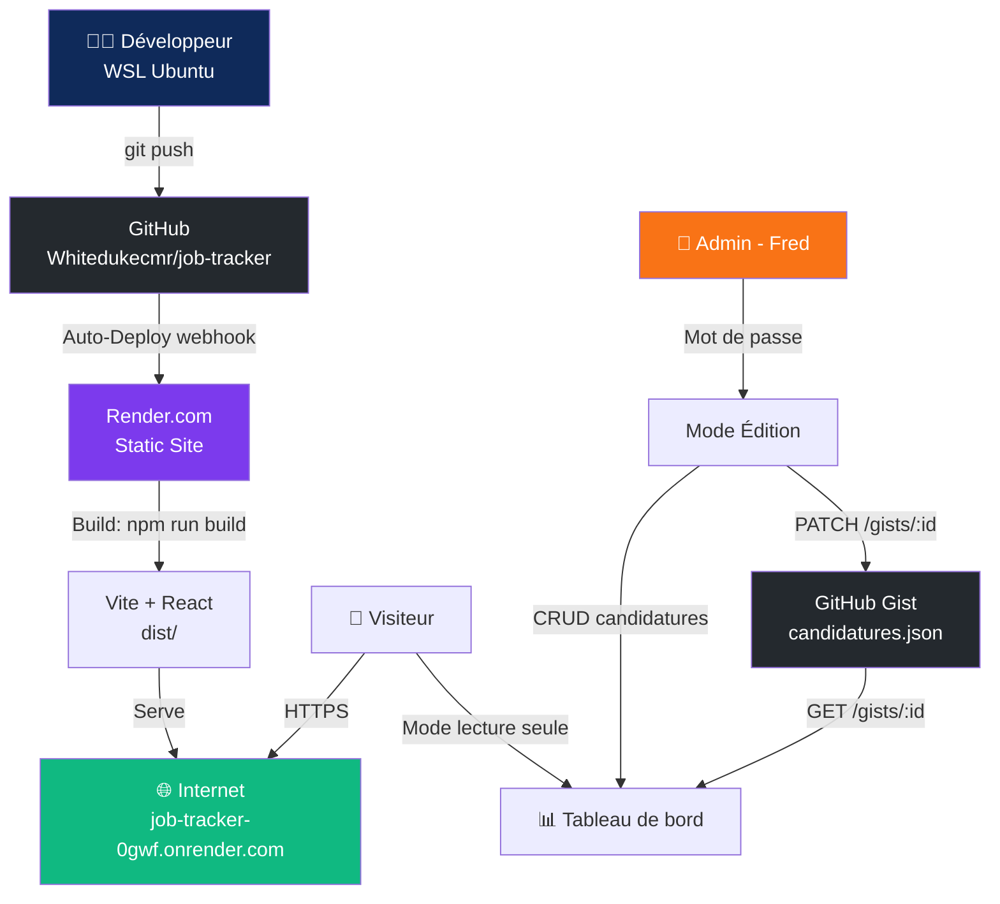

# 📋 Job Tracker — Suivi de Candidatures

> Application web de suivi de candidatures d'emploi, déployée sur Render avec persistance GitHub Gist et mode admin sécurisé.

**🔗 Live : [https://job-tracker-0gwf.onrender.com](https://job-tracker-0gwf.onrender.com)**

---

## Architecture



---

## Stack technique

| Composant | Technologie | Rôle |
|-----------|-------------|------|
| Frontend | React 18 + Vite | Interface utilisateur |
| Build | Vite 5 | Bundler + optimisation |
| Containerisation | Docker + Nginx | Serve statique local |
| CI/CD | Render.com | Auto-deploy sur git push |
| Persistance | GitHub Gist API | Stockage des candidatures JSON |
| Sécurité | Mot de passe admin | Contrôle lecture/écriture |
| Orchestration | docker-compose | Stack locale WSL |

---

## Fonctionnalités

### Tableau de bord
- Compteurs en temps réel : Total, Envoyées, Entretiens, En attente, Refus
- Filtres par statut et type d'entreprise
- Barre de recherche full-text
- Design navy/cyan responsive

### Gestion des candidatures
| Champ | Description |
|-------|-------------|
| Entreprise | Nom de la société |
| Type | ESN / Éditeur cloud / Grand compte / Startup / Autre |
| Poste | Intitulé du poste |
| Statut | À envoyer / Envoyée / Relance faite / Entretien / Refus |
| Date envoi | Date de candidature |
| Date relance | Date de suivi |
| Notes | Commentaires libres |

### Statuts colorés
- 🔵 **À envoyer** — Candidature non encore envoyée
- 🟠 **Envoyée** — CV/LM envoyés
- 🟣 **Relance faite** — Relance effectuée
- 🟢 **Entretien** — Entretien planifié ou passé
- 🔴 **Refus** — Candidature refusée

### Sécurité
- **Mode lecture seule** par défaut — n'importe qui peut consulter
- **Mode admin** protégé par mot de passe — seul l'admin peut modifier, ajouter, supprimer
- Token GitHub stocké en variable d'environnement Render (jamais dans le code)

### Persistance
- Données sauvegardées automatiquement sur **GitHub Gist privé** (JSON)
- Sauvegarde avec debounce 1.5s après chaque modification
- Export/Import JSON disponible en mode admin
- Synchronisation entre tous les appareils

---

## Structure du projet

```
job-tracker/
├── src/
│   ├── App.jsx          # Composant principal (tracker + auth admin)
│   └── main.jsx         # Entry point React
├── index.html           # Template HTML
├── package.json         # Dépendances Node.js
├── vite.config.js       # Configuration Vite
├── Dockerfile           # Multi-stage: Node build + Nginx serve
├── nginx.conf           # Config Nginx SPA (fallback index.html)
├── docker-compose.yml   # Stack locale: app + Cloudflare Tunnel
├── .env                 # Variables locales (non commité)
└── .gitignore
```

---

## Déploiement

### Production (Render.com)

Le déploiement est automatique à chaque `git push` sur `main`.

**Variables d'environnement Render :**
```
VITE_GITHUB_TOKEN=ghp_...     # Token GitHub (scope: gist)
VITE_ADMIN_PASSWORD=...        # Mot de passe admin
```

**Configuration Render :**
- Type : Static Site
- Build Command : `npm install && npm run build`
- Publish Directory : `dist`

### Local (WSL + Docker)

```bash
# Cloner et configurer
git clone https://github.com/Whitedukecmr/job-tracker.git
cd job-tracker

# Créer le fichier d'environnement
cat > .env << 'ENVEOF'
TUNNEL_TOKEN=ton_token_cloudflare
ENVEOF

# Lancer
docker-compose up -d

# Accès local
http://localhost:3030

# Voir l'URL tunnel Cloudflare
docker-compose logs cloudflared | grep trycloudflare
```

---

## Workflow de développement

```bash
# 1. Modifier le code
nano src/App.jsx

# 2. Tester localement (optionnel)
npm run dev

# 3. Committer et pousser
git add .
git commit -m "feat: description de la modification"
git push

# → Render détecte le push et redéploie automatiquement en ~1 minute
```

---

## Données

Les candidatures sont stockées dans un **GitHub Gist privé** au format JSON :

```json
[
  {
    "id": 1,
    "company": "Neurones / SIZING",
    "type": "ESN",
    "role": "Ingénieur de Production DevOps",
    "status": "Envoyée",
    "sentDate": "24/06/2026",
    "followUpDate": "",
    "notes": ""
  }
]
```

---

## Candidatures suivies

| Entreprise | Type | Poste | Statut |
|------------|------|-------|--------|
| Neurones / SIZING | ESN | Ingénieur de Production DevOps | Envoyée |
| OVHcloud | Éditeur cloud | Ingénieur Production / Cloud Ops | À envoyer |
| Devoteam | ESN | Ingénieur de Production / SysOps | À envoyer |
| Société Générale | Grand compte | Ingénieur Infrastructure / SysOps | À envoyer |
| Constellation (spontanée) | ESN | Ingénieur de Production / SysOps | Envoyée |

---

## Auteur

**Fred EPESSE PRISO** — Ingénieur de Production / SysOps DevOps  
5ème année ESGI — Classe 5ASRCB  
GitHub : [@Whitedukecmr](https://github.com/Whitedukecmr)
